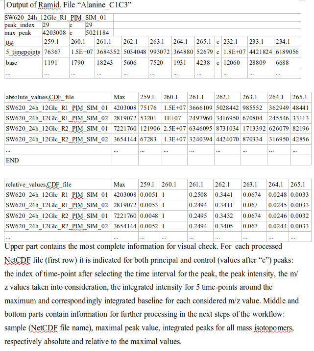
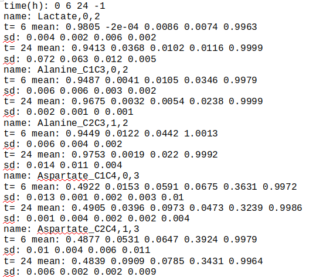

# Ramid, Midcor, Isoform
Stable Isotope Resiolved Metabolonics (SIRM): preparation of data from raw mass spectrometers recording to  fluxomic analysis. 


Version: 1.0

## Short description
A suit of R-programs designed to extract mass spectra (MS) of 13C-labeled metabolites of interest from raw mass spectrometer recordings, correct them for natural isotope occurrence, grouping the data designed for simultaneous reproducing in a kinetic model.

## Description
Ramid extracts mass spectra of 13C-labeled metabolites of interest from raw mass spectrometer recordings of the time course of their elution from a chromatography column. A description text file should specify the metabolites of interest by their m/z values and retention time (RT). Ramid evaluates mass isotopomer distributions (MID) of metabolites at the moments of their maximal elution rates, expected to be close to the specified a priori RT values. Ramid uses library "ncdf4" to read the NetCDF files containing the raw data. It is necessary to install it before the first use of Ramid. The files "ramid.R" and "lib.R" located in a subdirectory 'R' contain the complete code of Ramid. Its functions reside in reading NetCDF files, extracting and visualizing the spectra that they contain. 
<p>Midcor takes the spectra extracted by Ramid and corrects them for natural isotope occurrence and possible overlapping with those of some foreign substances. Thus it provides the mass isotopomer distribution (MID) produced by isotopes artificially introduced into the substrates used.</p>
Isoform reads the results of Midcor and prepares the data for simulation with Isodyn.  For each metabolite, groups the corrected MID by the conditions that will be simulated and then by the time of sampling. Then it finds the mean value and SD inside the groups, combines the obtained values for all the metabolites whose MID Isodyn will use in the same simulation.
## Key features
- primary processing raw mass spectrometry data saned in NetCDF files

## Functionality
- Extraction of MID of metabolites of interest specified in a text file. It processed a series of NetCDF files in one run.
- Correction of the extracted MID
- Preparation of the corrected data to simulation by Isodyn

## Approaches
- Using mz and retention time (RT) values to localize the metabolites of interest in the raw MS recordings
    
## Instrument Data Types
- MS

## Data Analysis
- __Ramid:__ 
*  reads a NetCDF file presented in a directory specified by an input parameter, and then
*  separates the time courses of the metabolite elution for the selected m/z values around the RT, both indicated in the description text file, whose name is specified by an input parameter;
*  corrects baseline for each selected mz;
*  determines the actual retention time, which can be different from that indicated a priori in the description file
*  integrates the localized peaks thus evaluating the distributions of mass isotopomers of metabolites of interest;
*  repeats all the previous steps for the next NetCDF file until all such files are processed;
*  saves the extracted MID from all the processed NetCDF files for each metabolite of interest separately in text files readable by MIDcor, a program, which supports the next step of analysis, i.e. correction of the RaMID spectra for natural isotope occurrence.
- Midcor
*  reads the results of Ramid and corrects the MID of the metabolites of interest for natural isotope occurrence and overlapping with the foreign peaks
- Isoform
*  reads the results of Midcor and prepares the data for simulation with Isodyn

## Tool Authors
- Vitaly Selivanov (Universitat de Barcelona)

## Container Contributors
- Pablo Moreno(EBI)

## Website
- N/A

## Git Repository
- https://github.com/seliv55/ramidcor

## Installation

- To use the presented R-programs clone or download this directory. The R library 'ncdf4' that supports reading NetCDF files should be installed. Also, a library containing Ramid can be created from the code available here, although this is an option. Another option is to read source files directly in each session (see below). To make the library 'ramidcor' the library 'devtools' should be installed. The library 'ramidcor' would contain Ramid, Midcor for the correction of the Ramid extracted spectra and Isoform for formatting the corrected data to prepare them for simulation with Isodyn. To install 'ncdf4', 'devtools' and make the library 'ramidcor' use the following commands:

   
```
 cd <ramidcor>
 
 sudo R
 
 install.packages(‘ncdf4’)

 install.packages(‘devtools’)

 library(devtools)
 
 build() 
 
 install() 
 ```
## Usage Instructions

- The programs Ramid, Midcor, Isoform support three subsequent steps of preparation of raw MS data for the fluxomic analysis. 
### 1. Extraction of raw mass spectra from NetCDF files saved by a mass spectrometer using Ramid:

  
```
 cd <path_to_ramidcor>
 
 R 
 
 # if the library 'ramidcor' was not created, then read the source directly:
 
 source("R/ramidwin.R") 
 
 source("R/lib.R")
 
 # if the library 'ramidcor' was created, load it:
 
 library(ramidcor)
 
 library(ncdf4)
 
 # run Ramid:
 
  ramid(infile='<path_to_description>',cdfdir='<path_to_NetCDFs/>',fiout='out.csv',md='scan')
```
- here the first parameters is the path to a text file containing a short description of the metabolites of interest exemplified in the screenshot below; the second parameter is the path to a directory containing the .CDF files with raw mass spectrometer data; 


the third parameter is a path to the output file where the (MID) of all the metabolites of interests are grouped in the format provisional for the database Metabolights; the third parameter is the mode of the mass spectrometer recording, the default value is 'scan'. However, in addition to the default output 'out.csv' Ramid produces a series of files in the directory '../files/\<NetCDFs/\>', where the data for each metabolite extracted from all the available NetCDF files are saved in separate text files under the names of the corresponding metabolite. Then the extracted spectra can be checked and wrong data edited/eliminated manually. An example of such an output is shown here


### 2. Correction of Ramid output by Midcor.

After completing the extraction of the mass spectra of interest Midcor can read the files generated by Ramid for each metabolite of interest and correct them for natural isotope occurrence taking the information of the chemical composition of the analyzed derivated metabolite molecule from the same description text file that is used as an input for Ramid and exemplified in the screenshot above (column Formula). The following commands should be used to execute Midcor in separate session:
 
```
cd <path_to_ramidcor>
 
 R 
 
 # if the library 'ramidcor' was not created, then read the source directly:
 
 source("R/midcor.R") 
 
 source("R/lib.R")
 
 # if the library 'ramidcor' was created, load it:
 
 library(ramidcor)
 
 # run Midcor:
 
 midcor(infile='<path_to_description>',dadir='<path_to_Ramid_results/\>')
```
Midcor saves the corrected MID in text files naming them by adding the extension .txt to the names of corresponding input files (which are the outputs for Ramid). If Midcor executed in the same session as Ramid, not all the above commands should be used, but only those not used for Ramid execution. Then the corrected data can be checked and wrong data edited/eliminated manually.
An example of the format in a text file of Midcor output is shown here


### 3. Preparation for simulation performed by Isodyn
Midcor corrects the MID for all of the provided samples, which may refer to distinct conditions that the tool Isodyn designed for simulations of system dynamics should reproduce separately. Also, the data related to different time points of incubation Isodyn treats accordingly. Moreover, it accounts not every sample, but rather the mean values for the chosen conditions and time point of incubation. The tool Isoform reads the output of Midcor, groups the data by the condition, and by incubation time for the data of the given condition. Then it finds the mean values and standard deviations of relative labeling in the selected groups and saves such data prepared for simulation. 
* It takes the information, necessary to perform such a preparation of data, from a text file that should be provided with respect to the following format:


The first line contains the names of metabolites, whose data Isodyn will simulate, and first and last carbons of the fragment that was registered. The names of metabolites at the same time are the names of files where the respective MID were saved. The second line indicates the available time points of incubation. The third line shows the conditions, in the presented example, it is a nickname of the tracer, as it is abbreviated in the names of the NetCDF files. The last line shows the specific isotopomer used as a tracer. It represented by the binary numbers, assuming that 1 is 13C and 0 is 12C. In this way, 1,2-13C -Glucose is expressed as binary 110000 that, being transformed into the decimal, means 48; uniformly labeled glutamine is represented as 11111, which, being converted into the decimal, means 31. The last number is the fraction of the tracer in the provided substrate.
Thus, the first line indicates the file name where to search the MID of interest, and the information presented in the other lines the program searches in the names of the NetCDF files.
#### The names of CDF files provided
- The names of CDF files should contain specific information referred to each separate measurement. Here is an example of the filename: "SW620_6h_12Glc_R1_PIM_SIM_01.CDF". SW620 is the type of analyzed cells 6h is the time of incubation 12Glc indicates the artificially labeled substrate applied. R1 is an index of biological replicate 01 is an index of injection to MS machine from the same biological replicate.
- The following commands should be used to execute Isoform in separate session:
```
 cd <path_to_ramidcor>
 
 R 
 
 # if the library 'ramidcor' was not created, then read the source directly:
 
 source("R/isoform.R") 
 # if the library 'ramidcor' was created, load it:
 
 library(ramidcor)
 
 # run Isoform:
 isoform(isofi='<path_to_instruction_file>', dor ='<path_to_Midcor_results>',marca=2)
```
- If Isoform executed in the same session as the tools supporting the previous steps, not all the above commands should be used, but only those not used previously.
- Isoform saves the MID of the metabolites designed for Isodyn to simulate simultaneously in the same run of the program. 
An example of the format in a text file of Midcor output is shown here


This file indicates the information necessary for simulation: time points of sampling during incubation; mean values and SD of labeling for various metabolites and time points. Isodyn reads this information and adjust simulations respectively.
## An example provided

- Run the provided example using the command:

```
 cd <.../>ramidcor
 R
 source("R/ramidwin.R")
 source("R/lib.R")
 ramid(infile='sw620',cdfdir='SW620/')
 source("R/midcor.R") 
 midcor(infile="sw620",dadir='files/SW620/')
 source('R/isoform.R')
 isoform(isofi='toIsodyn',dor='files/SW620/')
```


